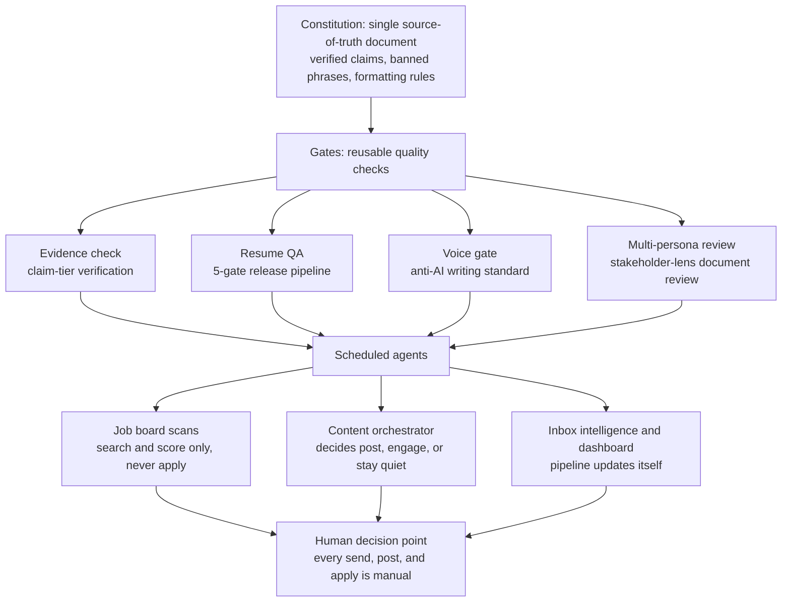

# The System in One Diagram

CareerOS has the same three layers as any decent platform: a source of truth, deterministic gates, and scheduled workers. The human sits at the only decision point that matters.

Three properties fall out of this shape:

**Conflicts get adjudicated once.** When two documents disagree on a number, both freeze until the human rules, and the losing figure is retired permanently. No claim is ever re-litigated.

**Agents score, humans commit.** Every scheduled agent stops at a recommendation. Nothing applies, posts, or sends on its own.

**Writing has a release gate too.** Anything published runs through the voice standard and an AI-detection pass, the way code runs through CI.

See [CONSTITUTION.md](CONSTITUTION.md) for the laws, [TEMPLATES.md](TEMPLATES.md) for the gate prompts, and [MODULES.md](MODULES.md) for the roadmap.
